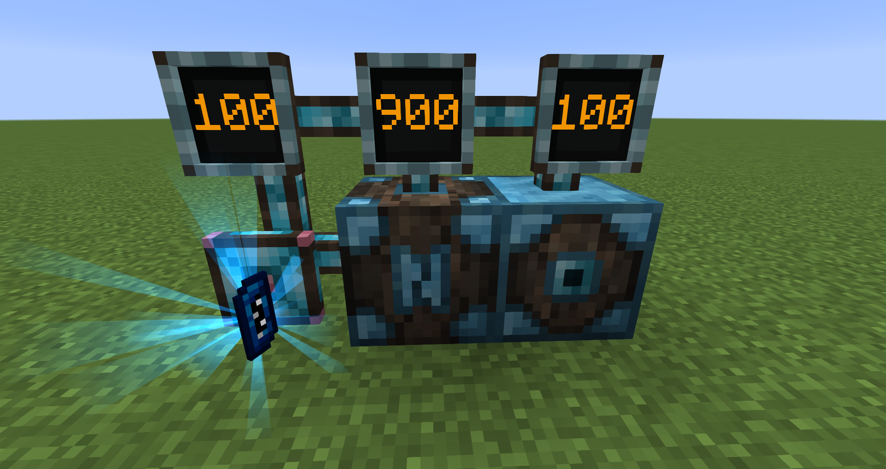
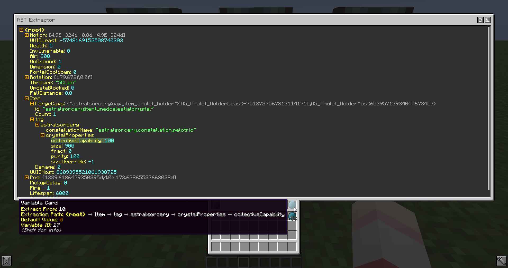
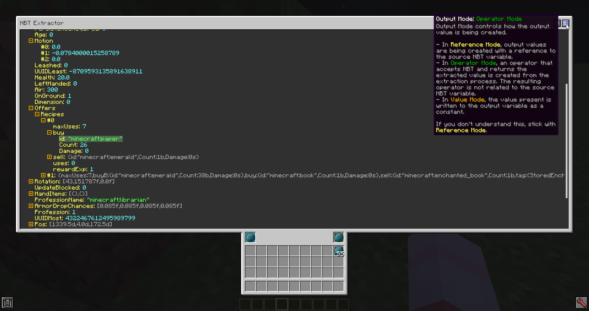
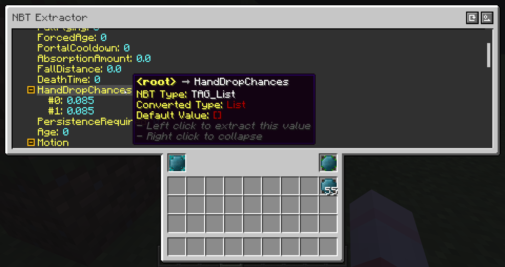

# Integrated NBT

Integrated NBT is an addon for Minecraft mod [Integrated Dynamics](https://github.com/CyclopsMC/IntegratedDynamics). It adds a simple and fast way of extracting deeply nested values from a complex NBT variable via a graphical user interface.

Screenshots:

Support for different output modes:

GUI is responsive and usable across all GUI scales and screen resolutions:

See [GitHub Wiki](https://github.com/CyclopsMC/IntegratedNBT/wiki) for a brief tutorial on how to use this mod.

All stable releases (including deobfuscated builds) can be found on [CurseForge](https://www.curseforge.com/minecraft/mc-mods/integrated-nbt).

[Development builds](https://github.com/CyclopsMC/packages/packages/) are hosted as GitHub packages.

### Contributing
* Before submitting a pull request containing a new feature, please discuss this first with one of the lead developers.
* When fixing an accepted bug, make sure to declare this in the issue so that no duplicate fixes exist.
* All code must comply to our coding conventions, be clean and must be well documented.

### Issues
* All bug reports and other issues are appreciated. If the issue is a crash, please include the FULL Forge log.
* Before submission, first check for duplicates, including already closed issues since those can then be re-opened.

### Branching Strategy

For every major Minecraft version, a `master-{mc_version}` branch exists.

### License
All code and images are licenced under the [MIT License](https://github.com/CyclopsMC/IntegratedTerminals/blob/master-1.12/LICENSE.txt)

### Special Thanks

@SCLeoX For initially creating this mod

@Anoyomouse For porting to 1.18.2

@tdaffin For porting to 1.19.2

CyclopsMC has taken over maintenance of this mod since 1.20.1.
